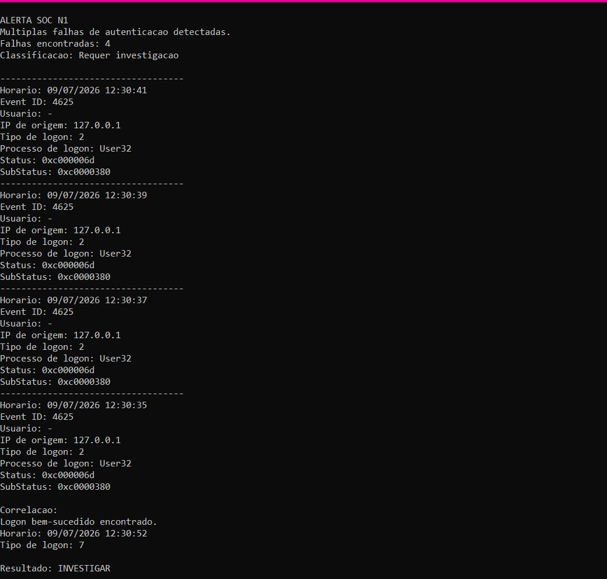

# 🛡️ SOC Windows Authentication Lab

Esse laboratório foi criado para praticar análise de falhas de autenticação no Windows usando **PowerShell** e os eventos do **Windows Security Log**.

A ideia foi simular algumas tentativas de login com senha incorreta e criar um script que identificasse várias falhas acontecendo em um curto período de tempo.

## O que foi feito

Para o teste, defini uma regra simples:

- 4 falhas de autenticação
- dentro de 5 minutos
- análise dos eventos 4625
- busca por um login bem-sucedido depois das falhas

O script consulta o log `Security` do Windows e, quando encontra a quantidade de falhas definida, mostra algumas informações que podem ajudar na análise:

- horário
- usuário
- IP de origem
- tipo de logon
- processo de logon
- Status e SubStatus

Também fiz uma correlação com o evento **4624**, para verificar se houve uma autenticação bem-sucedida depois das tentativas.

## Resultado

Durante o teste foram encontradas 4 falhas de autenticação com **Event ID 4625**.

Algumas informações observadas:

- IP de origem: `127.0.0.1`
- Logon Type: `2`
- Processo: `User32`

Depois das falhas, foi encontrado um evento **4624**, com **Logon Type 7**, indicando o desbloqueio da sessão.

O resultado apresentado pelo script foi:

**INVESTIGAR**

Isso não significa que houve um ataque. A regra apenas identificou um comportamento que atingiu os critérios definidos e que, em um cenário real, precisaria ser analisado antes de qualquer conclusão.

## Evidência



## Tecnologias usadas

<div align="center">


</div>

- Windows Event Viewer
- Windows Security Log

## Estrutura

```text
soc-windows-authentication-lab/
├── scripts/
│   └── Detect-FailedLogons.ps1
├── evidence/
│   ├── README.md
│   └── detection-result.png
└── README.md

